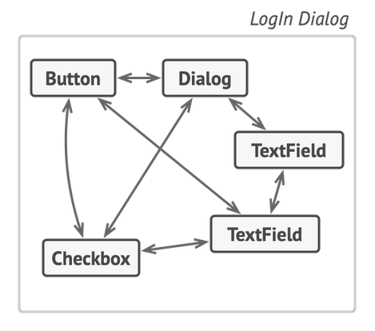
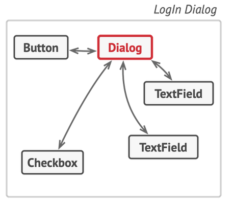
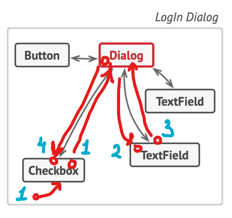
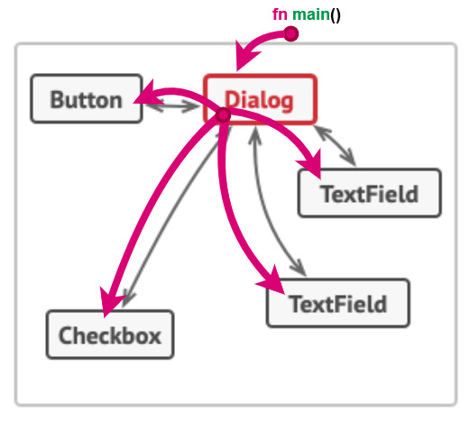

_For other design patterns in Rust, see [https://github.com/fadeevab/design-patterns-rust](https://github.com/fadeevab/design-patterns-rust)._

# Mediator Pattern in Rust

_*Mediator* is a challenging pattern to be implemented in *Rust*._ Here is **why** and **what ways** are there to implement Mediator in Rust.

## How to Run

```bash
cargo run --bin mediator-dynamic
cargo run --bin mediator-static-recommended
```

## Execution Result

Output of the `mediator-static-recommended`.

```
Passenger train Train 1: Arrived
Freight train Train 2: Arrival blocked, waiting
Passenger train Train 1: Leaving
Freight train Train 2: Arrived
Freight train Train 2: Leaving
'Train 3' is not on the station!
```

## Problem

A typical Mediator implementation in other languages is a classic anti-pattern in Rust: many objects hold mutable cross-references on each other, trying to mutate each other, which is a deadly sin in Rust - the compiler won't pass your first naive implementation unless it's oversimplified.

By definition, [Mediator][1] restricts direct communications between the objects and forces them to collaborate only via a mediator object. It also stands for a Controller in the MVC pattern. Let's see the nice diagrams from https://refactoring.guru:

| Problem                      | Solution                      |
| ---------------------------- | ----------------------------- |
|  |  |

A common implementation in object-oriented languages looks like the following pseudo-code:

```java
Controller controller = new Controller();

// Every component has a link to a mediator (controller).
component1.setController(controller);
component2.setController(controller);
component3.setController(controller);

// A mediator has a link to every object.
controller.add(component1);
controller.add(component2);
controller.add(component2);
```

Now, let's read this in **Rust** terms: _"**mutable** structures have **mutable** references to a **shared mutable** object (mediator) which in turn has mutable references back to those mutable structures"_.

Basically, you can start to imagine the unfair battle against the Rust compiler and its borrow checker. It seems like a solution introduces more problems:



1. Imagine that the control flow starts at point 1 (Checkbox) where the 1st **mutable** borrow happens.
2. The mediator (Dialog) interacts with another object at point 2 (TextField).
3. The TextField notifies the Dialog back about finishing a job and that leads to a **mutable** action at point 3... Bang!

The second mutable borrow breaks the compilation with an error (the first borrow was on the point 1).

**In Rust, a widespread Mediator implementation is mostly an anti-pattern.**

## Existing Primers

You might see a reference Mediator examples in Rust like [this][5]: the example is too much synthetic - there are no mutable operations, at least at the level of trait methods.

The [rust-unofficial/patterns](https://github.com/rust-unofficial/patterns) repository doesn't include a referenced Mediator pattern implementation as of now, see the [Issue #233][2].

**Nevertheless, we don't surrender.**

## Cross-Referencing with `Rc<RefCell<..>>`

There is an example of a [Station Manager example in Go][4]. Trying to make it with Rust leads leads to mimicking a typical OOP through reference counting and borrow checking with mutability in runtime (which has quite unpredictable behavior in runtime with panics here and there).

👉 Here is a Rust implementation: [mediator-dynamic](https://github.com/fadeevab/mediator-pattern-rust/mediator-dynamic)

🏁 I would recommend this approach for applications that need **multi-threaded support**: particular components after being added to the mediator can be sent to different threads and modified from there.

📄 Real-world example: [`indicatif::MultiProgress`](https://docs.rs/indicatif/latest/indicatif/struct.MultiProgress.html) (mediates progress bars with support of being used in multiple threads).

Key points:

1. All trait methods look like read-only (`&self`): immutable `self` and parameters.
2. `Rc`, `RefCell` are extensively used under the hood to take responsibility for the mutable borrowing from compilation time to runtime. Invalid implementation will lead to panic in runtime.


## Top-Down Ownership

☝ The key point is thinking in terms of OWNERSHIP.



1. A mediator takes ownership of all components.
2. A component doesn't preserve a reference to a mediator. Instead, it gets the reference via a method call.
    ```rust
    // A train gets a mediator object by reference.
    pub trait Train {
        fn name(&self) -> &String;
        fn arrive(&mut self, mediator: &mut dyn Mediator);
        fn depart(&mut self, mediator: &mut dyn Mediator);
    }

    // Mediator has notification methods.
    pub trait Mediator {
        fn notify_about_arrival(&mut self, train_name: &str) -> bool;
        fn notify_about_departure(&mut self, train_name: &str);
    }
    ```
3. Control flow starts from `fn main()` where the mediator receives external events/commands.
4. `Mediator` trait for the interaction between components (`notify_about_arrival`, `notify_about_departure`) is not the same as its external API for receiving external events (`accept`, `depart` commands from the main loop).
    ```rust
    let train1 = PassengerTrain::new("Train 1");
    let train2 = FreightTrain::new("Train 2");

    // Station has `accept` and `depart` methods,
    // but it also implements `Mediator`.
    let mut station = TrainStation::default();

    // Station is taking ownership of the trains.
    station.accept(train1);
    station.accept(train2);

    // `train1` and `train2` have been moved inside,
    // but we can use train names to depart them.
    station.depart("Train 1");
    station.depart("Train 2");
    station.depart("Train 3");
    ```

A few changes to the direct approach leads to a safe mutability being checked at compilation time.

👉 A Train Station primer **without** `Rc`, `RefCell` tricks, but **with** `&mut self` and compiler-time borrow checking: https://github.com/fadeevab/mediator-pattern-rust/mediator-static-recommended.

👉 A real-world example of such approach: [Cursive (TUI)][5].

[1]: https://refactoring.guru/design-patterns/mediator
[2]: https://github.com/rust-unofficial/patterns/issues/233
[3]: https://chercher.tech/rust/mediator-design-pattern-rust
[4]: https://refactoring.guru/design-patterns/mediator/go/example
[5]: https://crates.io/crates/cursive
